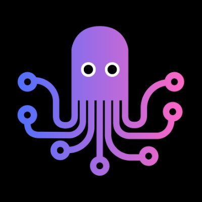

# Medusa Q and A

The answers were picked from the Discord discussions we have in the community


## Will this be the next logo ?

(FOR INSPIRATION ONLY)



[SOURCE https://twitter.com/aisolopreneur]

I have always thought that the animal was the inspiration for medusa naming, not the mythological figure

No need to change the actual logo imo, it can have many diffrents geometrical interpretations

## What is the Medusa Tech Stack

```
Node/NPM
Yarn
TypeScript
TypeORM
SQLite
PostGresSQL
Redis
Docker
React
Next
TailWind
Ubuntu
Git/GitHub
```

And of course the plugins, Stripe, PayPal, Meilisearch, ...

## What mean headless solution

A headless solution is decoupled from your frontend so that you can leverage whichever framework you're using.
Medusa gives you the engine plus some js tools to interact with it. What you'll do with is up to you.
You most likely don't want to use full url linking. In such cases you're losing the benefit of client side routing. 
Full url linking means a full website refresh.

I don't know what kind of framework you are using but you most likely will use something like Next.js, Remix, Astro or whatever
Then you can and should leverage its router and tools. 
You might use Remix nested routes: https://remix.run/docs/en/v1/guides/routing
Maybe Next.js static generation with client side routing. Or the new nested layouts routing.
In all those cases you want to use the handle property of the product object and use it for your routing.
You can check out nextjs medusa starter for inspiration.

## How to display products

GO CHECK [products.md](products.md)

## I want to have multiple stores and one admin, how ?

Try sales channel

## I want to deploy medusa on Netlify, how ?

Use the same domain for the three instances

If you want to sell soemthing, you probably own a domain. So you should point that domain to your deployments. yourdomain.com to storefront. admin.yourdomain.com to admin. api.yourdomain.com to your backend deployment. 

Still storefront and admin can be on Vercel or Netlify

Be aware that Vercel doesn't allow commercial use for free. Netlify does

## How to run Medusa with PM2

`pm2 start npm --name "medusa-server" -- run start`

app_name: medusa-server

script_name: start (from package.json)

other way

`pm2 start "NODE_ENV=production npm run start"`

in our case 

```
cd my-medusa-store
pm2 start npm --name "medusa-server" -- run start
```

```
cd my-medusa-storefront
pm2 start npm --name "medusa-storefront" -- run dev
```

```
cd medusa-admin
pm2 start npm --name "medusa-admin" -- run dev
```

Little shell script

```
sudo service postgressql start
sudo service redis-server start
cd <path-to-store>/my-medusa-store
pm2 start npm –name “medusa-server” – run start
cd <path-to-store>/medusa-admin
pm2 start npm –name “medusa-admin” – run dev
cd <path-to-store>/my-mdusa-storefront
pm2 start npm –name “medusa-storefront” – run dev
```

## How to configure the Admin Connection

Go to https://github.com/medusajs/admin/blob/819a4acc89b21fabef7ca03dfc6ebac174c7619f/src/services/config.js and add

```
//const medusaUrl = __MEDUSA_BACKEND_URL__ || "http://localhost:9000"
const medusaUrl = __MEDUSA_BACKEND_URL__ || "https://api.instant-market.com"

export { medusaUrl }
```

## How to run in production mode

When using extender

`"start:prod": "npm run build && NODE_ENV=production node dist/main"`

## Gatsby or Next for the frontend

The nextjs is more up to date now. And AFAIK only this one will get future updates. For me next.js is far more superior then Gatsby. 

## Should I use vercel or netlify public domains

I would advise to not use vercel.app ,netlify.app domains

They are on the public suffix list, and because of that the server can't set the cookies needed for authentication, if the user accessing the site from most modern browsers such as Chrome, Firefox, etc. 

Public suffix list: https://publicsuffix.org/list/public_suffix_list.dat 

CONTRADICTION https://custom-search-engine-fashion-demo.netlify.app/ works with Heroku

## How to troobleshoot Admin creds connection

- Install Medusa and seed the database with `--seed`
- Install Admin
- CORS
- Check that you are using the right url
  - If it's localhost use the right PORT 
  - If you are using a domain name use the subdomains
- Check that you are using https
- Cookies are set by the Admin and you can inspect that in the Dev Tools

## Hosting Medusa Solution

There is not only one solution to host Medusa 

- First solution

I deploy on AWS and Azure but find it would be easier in Digital Ocean for beginners to deploy
[00:48]
My simplest environment is:

Medusajs server: Redis + EC2 (server hosting) + Postgres DB

Frontend: Nextjs : deployed on Vercel

Admin: Vite + React : deployed on Netlify or Vercel

for commercial use see [this](https://github.com/nazimboudeffa/medusa-qanda/blob/main/README.md#i-want-to-deploy-medusa-on-netlify-how-)

- Second solution

1vcpu, 2GB RAM server with a swap file should handle medusa stack with no problem. Though I still would recommend at least 2 cores and 4GB RAM. Then scale up if needed.

Using Digital Ocean Spaces for hosting images but again you could spin up a MInio app in Dokku or Coolify in few minutes.

Using Dokku but Coolify works fine too

There's a opinion that databases, storage should be hosted elsewhere on managed instances (Managed Postgres, Redis, S3, Spaces).
But many companies are actually hosting all of those by themselves. It is actually very common to host everything on premise.
One thing I do is offsite database backups which I sync either to Digital Ocean Spaces or AWS S3.

- More tips

If you want to deploy Nextjs on your own VPS, here's your guide: https://github.com/serverless-stack/open-next/blob/main/README.md

The Image Optimisation in Nextjs just works, there's nothing to it. One thing you could do if you want to preserve the cached images during build deploys, is bind /.next/cache/images to a docker volume. Which is also easy as hell in Coolify and Dokku.

Project https://nomodo.io/medusajs

## How to troobleshoot Postman Admin API

Start by login with postman

POST request to http://localhost:9000/admin/auth

{ 
    "email": "admin@medusa-test.com", 
    "password": "supersecret" 
}

the GET request to http://localhost:9000/admin/products

## API TOKEN ERROR with Postman

remove the authorization TOKEN

## Medusa migration

I could see the migrations runs and the database updated with the new table. I followed just the same steps. create an entity, created a repository, make migration file for the new table, updated the up and down functions in migration file, npm run build and medusa migrations run command.

I used the following command while creating them manually.

`npx typeorm migration:create -n Post --dir src/migrations`

I used the following command while using medusa-extender

`medex generate --module --entity --repository --migration Post`

## Some words about Medusa Extender

I need to understand things about Medusa (and its MedusaExtender package)

Theoretically, if I want to modify my back-end to add custom fields, I need to first :


- Create a new entity that extends the Medusa one 
The extended entity will contains all the custom fields and the new relationships

- Create a migration linked to the addition of the new fields
Migrations let you update tables with the up function, the down function is maybe used if I want to revert the migration ?

- Create a new repository that extends the Medusa one and that returns the previously created entity 
Also this is where you can override existings methods, like a method to find an entity with the id or to save a new entity, you also pass your CustomEntity previously created

- Inject the custom repository in a custom service and override its retrieve function with the new entity (I don't know why yet)
What is the purpose of a service ? a set of business logic that is using the previously created CustomRepository ?

- Create a module that imports the Entity, the repository, the service and the different migrations 
The CustomModule will imports all your extended classes and will be imported in the main.ts file at the root of the src folder

- Load all the modules inside the load function inside the main.ts

Is that correct ?

## Cart not found error

Just clear the Cookies, cache

## Meilisearch troobleshooting

the step to troobleshoot this issue (which is why Meilisearch doesn't display products) are :

- check if the postgresDB is installed
- check if the database has been seeded
- check if redis is installed
- check if redis-cli ping, PONGs
- check if redis uses a password (to be verified)
- check if the storefront is correctly configured

## How to start medusa on another port

```
  "scripts": {
    "dev": "medusa develop --port 9001",<----------
    "seed": "medusa seed -f ./data/seed.json",
    "build": "babel src -d dist --extensions \".ts,.js\"",
    "start": "medusa develop"
  },
```

## Docker

Docker was actually never officially supported. There's a repository with Dockerfiles that offers a good starting point, though they have not been updated for a while and are not actively maintained

## Where is the official next frontend deployment

https://next.medusajs.com/

## About next13

Hey, no plans for updating the starter in the foreseeable future. We are focussed on shipping new features for the core. I will upgrade the starter to Next 13, once the app directory is out of beta, but until then it is staying on 12 🙂

## Change the port

The default port is 9000, if you want to run the server on a custom port update medusa-config.js as follows:

```
module.exports = {
  /* ... */
  serverConfig:{
    port: <PORT_NUMBER>
  }
  /* ... */
};
```
